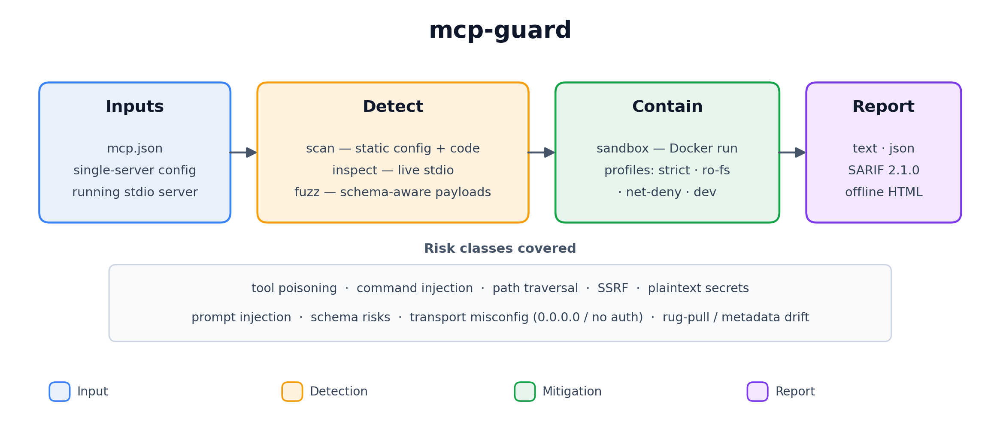

# mcp-fence

[](https://github.com/DaoyuanLi2816/mcp-fence/actions/workflows/ci.yml)
[](https://pypi.org/project/mcp-fence/)
[](https://www.python.org)
[](LICENSE)

> Local-first security scanner, MCP protocol inspector, dynamic fuzzer,
> Docker sandbox, and report generator for **Model Context Protocol**
> servers.



`mcp-fence` is a developer tool. Point it at your `mcp.json` (or any
running MCP server you wrote) and it will:

1. **Statically scan** the config and source for tool poisoning,
   dangerous startup commands, plaintext secrets, schema gaps, and
   unauthenticated HTTP transports.
2. **Inspect** the server live over stdio — runs `initialize`,
   `tools/list`, gathers schemas/annotations.
3. **Fuzz** every tool with schema-aware payloads (path traversal,
   command injection, SSRF, prompt injection, oversize input, type
   confusion). Safe by default; opt in to runtime payloads via
   `--toy-mode` or `--allow-unsafe`.
4. **Sandbox** any stdio server in Docker with sensible profiles
   (`strict`, `filesystem-readonly`, `network-deny`, `dev`).
5. **Report** findings as a plain-text table, JSON, SARIF 2.1.0 (for
   GitHub code scanning), or a fully offline HTML page.

It is **non-destructive**, **local-first**, and uses **no cloud LLM by
default**. An optional local-LLM judge can talk to a local Ollama or
OpenAI-compatible endpoint.

## Install

From PyPI:

```bash
pip install mcp-fence
```

From source (for contributors):

```bash
git clone https://github.com/DaoyuanLi2816/mcp-fence
cd mcp-fence
python -m venv .venv
source .venv/bin/activate          # Windows: .venv\Scripts\activate
python -m pip install -e ".[dev]"
```

Requires Python 3.11+.

## 30-second quickstart

```bash
# 1. Bring up the bundled examples in your working directory.
mcp-fence init-example ./mcp-fence-examples

# 2. Static scan the intentionally poisoned metadata server.
mcp-fence scan examples/vulnerable_metadata_server/mcp.json

# 3. Live-inspect the safe baseline.
mcp-fence inspect examples/safe_server/mcp.json

# 4. Fuzz the arbitrary-file-read server.
mcp-fence fuzz examples/vulnerable_filesystem_server/mcp.json

# 5. Generate a `docker run` command that sandboxes any of the above.
mcp-fence sandbox examples/vulnerable_filesystem_server/mcp.json \
    --profile strict --dry-run

# 6. Turn a saved JSON result into an offline HTML report.
mcp-fence scan examples/vulnerable_metadata_server/mcp.json \
    --format json --output /tmp/scan.json
mcp-fence report /tmp/scan.json --format html --output /tmp/scan.html
```

## Example output

```
mcp-fence 0.1.0 :: scan :: target=examples/vulnerable_metadata_server/mcp.json
  summary: total=1 score=7/100 verdict=FAIL
  by_severity: high=1
  by_category: secrets=1

# Findings
  SEV   RULE     TITLE                    CATEGORY  WHERE                    DETAIL
  HIGH  MCPG006  Plaintext secret in env  secrets   param=OPENAI_API_KEY     Environment variable OPENAI_API_KEY appears to be a plaintext secret.
```

## Supported transports

| Transport         | scan | inspect | fuzz | sandbox | Notes                                            |
| ----------------- | ---- | ------- | ---- | ------- | ------------------------------------------------ |
| stdio             | ✓    | ✓       | ✓    | ✓       | First-class.                                     |
| streamable-http   | ✓    | —       | —    | —       | Static (config) only; live HTTP inspector v0.2.  |
| sse / websocket   | ✓    | —       | —    | —       | Same.                                            |

## Supported risk classes

Full catalog in [`docs/rule_catalog.md`](docs/rule_catalog.md). Highlights:

- **Tool poisoning** — prompt-injection phrases in tool descriptions,
  hidden HTML comments, zero-width characters, confusable tool names
  (Unicode + ASCII visual confusables like `Iist_files` vs
  `list_files`).
- **Dangerous startup commands** — `shell=True`, `curl | sh`, `sudo`,
  `/var/run/docker.sock`, `--privileged`, references to `~/.ssh`,
  `~/.aws`.
- **Transport binding** — `0.0.0.0` + no auth, HTTP without bearer.
- **Schema risks** — unbounded strings, missing `additionalProperties`,
  high-risk param names (`command`, `path`, `url`, `webhook`, …)
  without pattern/enum/maxLength.
- **Dynamic** — path traversal hitting a planted fake secret, command
  injection marker echoed back, SSRF accepting metadata IPs, malformed
  input passing schema validation, sensitive patterns in tool output.
- **Protocol** — server hangs, schema mismatches, non-JSON output on
  stdio.

## Why MCP servers need their own scanner

MCP server output flows directly into an LLM's context. Anything in a
tool's description, name, or response can be interpreted by the
assistant as instructions:

- Tool *metadata* is attacker-controllable once you install someone
  else's server.
- Tool *inputs* are LLM-controllable and untrusted by default.
- Tool *outputs* end up in the LLM's prompt and can carry injection
  payloads from external content.

General-purpose SAST / npm-audit / pip-audit don't model any of this.
mcp-fence has rules and fuzzers built specifically for it.

## Safety boundaries

- **Non-destructive payloads.** The command-injection marker is
  `echo MCPG_FUZZ_MARKER_8f2a`. No `rm`, `mv`, `chmod`, or destructive
  primitives are ever emitted.
- **Local-first.** No code, configuration, or scan result is uploaded
  anywhere.
- **No cloud LLM by default.** Optional `--llm-judge` talks to a local
  endpoint only.
- **No public-network scanning.** SSRF payloads test the tool's
  validation behaviour; we don't initiate outbound requests for you.
- **Safe path probing.** Path-traversal payloads target a planted
  `fake_secret.txt` inside the bundled examples or any explicit
  `--traversal-target`. They never aim at `/etc/shadow` or `~/.ssh/`.

`--allow-unsafe` is an explicit safety hatch for use inside the
`mcp-fence sandbox` Docker profile. See [`SECURITY.md`](SECURITY.md) and
[`docs/sandboxing.md`](docs/sandboxing.md).

## Optional local-LLM judge (Ollama / vLLM)

For semantic suspiciousness scoring on tool descriptions, enable the
optional judge:

```bash
ollama pull qwen3:8b
mcp-fence scan examples/vulnerable_metadata_server/mcp.json \
    --inspect --llm-judge ollama --llm-model qwen3:8b
```

Sized for a 16 GB GPU (e.g. RTX 4080). Failures are silent: the core
scan completes either way. See [`docs/local_llm.md`](docs/local_llm.md).

## GitHub Action

Drop [`.github/workflows/mcp-fence.yml`](.github/workflows/mcp-fence.yml)
into any repo with an `mcp.json`. It scans every config and uploads
SARIF to GitHub's code scanning dashboard.

```yaml
- name: install mcp-fence
  run: pip install mcp-fence
- name: scan
  run: mcp-fence scan path/to/mcp.json --format sarif --output mcp-fence.sarif
- uses: github/codeql-action/upload-sarif@v3
  with:
    sarif_file: mcp-fence.sarif
    category: mcp-fence
```

## Five most useful commands

```bash
mcp-fence scan examples/vulnerable_metadata_server/mcp.json
mcp-fence inspect examples/safe_server/mcp.json
mcp-fence fuzz examples/vulnerable_filesystem_server/mcp.json
mcp-fence sandbox examples/vulnerable_shell_server/mcp.json --profile strict --dry-run
mcp-fence report /tmp/scan.json --format html --output /tmp/scan.html
```

## Roadmap

See [`docs/roadmap.md`](docs/roadmap.md). v0.2 adds AST-based source
scanning, HTTP/SSE live inspector, a local SSRF capture server, and a
pre-trained tool-poisoning classifier.

## License

Apache-2.0. See [`LICENSE`](LICENSE).
